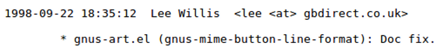
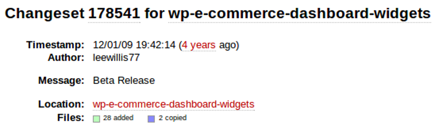
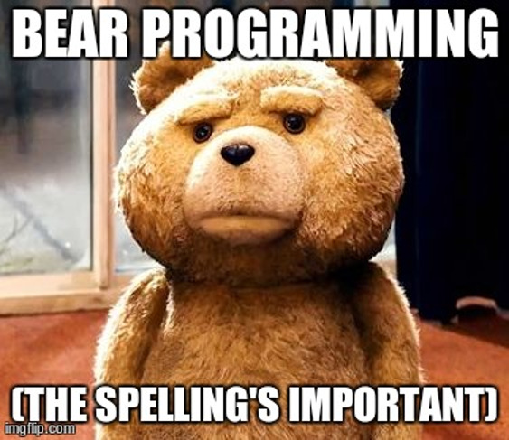
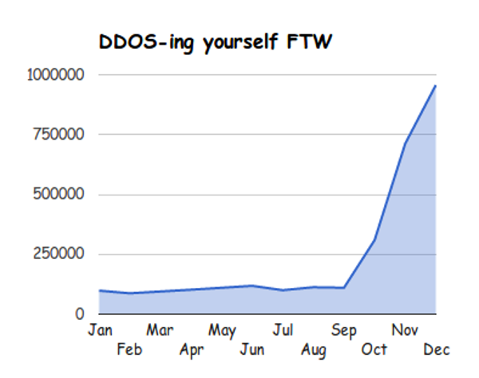

# Shipping code for fun & profit

!SLIDE title

# Shipping code for fun & profit
## 26 things I learned developing WordPress plugins
### Lee Willis - @leewillis77

!SLIDE

# About me

}}} images/me.png

!SLIDE

# Playing with OSS since '98
&nbsp;


!SLIDE
# Software dev / BA @ PlusNet

}}} images/the-band.png

!NOTES

* 11 years BTB (before the band)

!SLIDE

# 5 years as an IT out-sourcer

!SLIDE

# wordpress.org
### leewillis77

## WordPress plugin developer

!SLIDE

## 17 plugins on wordpress.org

!SLIDE

# Contributed to: 
* WordPress core
* WP e-Commerce
* WooCommerce
* EDD

!SLIDE

# Not as much as I'd like

}}} images/sad.jpg::http://www.flickr.com/photos/90692443@N05/8239219385/::::http://www.flickr.com/photos/90692443@N05/8239219385/

!SLIDE

## plugins.leewillis.co.uk

* 16 commercial plugins
* e-Commerce focussed
* Also sell through WooThemes and JigoShop

!SLIDE

## Oh, and also 

!SLIDE

# Drupal developer
&nbsp;


## *You* knew that right?

!SLIDE

# First class mistake-maker
### These are my lessons-learned

!SLIDE

# Ship your code
* It's good enough



<div class="tipno">#1</div>

!SLIDE

# Except version 2
## You have a responsibility

<div class="tipno">#2</div>

!SLIDE

<blockquote class="twitter-tweet">
	<p>A programmer has a problem. Solves it. Releases as open-source. Now has 10,000 problems</p>
	<p>&mdash; Stuart Sierra (@stuartsierra) <a href="https://twitter.com/stuartsierra/statuses/327536088338030592">April 25, 2013</a></p>
</blockquote>

!SLIDE 

<blockquote>
	<p>Support is hard, really hard, and it’s not something that most people are naturally good at.</p>
    <p>&mdash; @pippinsplugins <a href="http://pippinsplugins.com/getting-good-support">October 15, 2013</a></p>
</blockquote>

!SLIDE

# Be clear on support
&nbsp;


<div class="tipno">#3</div>

!SLIDE

# Be open to contributions

* Code (Bugs & features)
* Translations
* Documentation
* Feature requests, and suggestions

<div class="tipno">#4</div>

!SLIDE

# Be a good citizen

<div class="tipno">#5</div>

!SLIDE

# Contribute back
* Modules you depend on
* Drupal core
* Other code

!SLIDE

# Ways to contribute
* Bug triage
* Documentation
* Forums
* Evangelism
* i18n etc.
* Donations (if you can!)

!SLIDE

# Show and tell
* Not just to "n00bies"
- "Experts" love to learn too!

<div class="tipno">#6</div>

!SLIDE

## Stand on the giants' shoulders
* @mikebell_&nbsp;&nbsp;&nbsp;@webchick&nbsp;&nbsp;&nbsp;@learningdrupal
* @dries&nbsp;&nbsp;&nbsp;@lullabot&nbsp;&nbsp;&nbsp;@eaton
* @Crell&nbsp;&nbsp;&nbsp;@drupal8changes

<div class="tipno">#7</div>

!SLIDE

# Even better
## Find a bear
<div class="tipno">#8</div>


!SLIDE

# "Where can i find a bear?"

!SLIDE
## <del>The woods</del>

!SLIDE
* Meetups&nbsp;&nbsp;&nbsp;&nbsp;&nbsp;&nbsp;&nbsp;&nbsp;&nbsp;&nbsp;&nbsp;Forums&nbsp;&nbsp;&nbsp;&nbsp;&nbsp;&nbsp;&nbsp;&nbsp;&nbsp;&nbsp;&nbsp;&nbsp;
* &nbsp;&nbsp;&nbsp;&nbsp;&nbsp;&nbsp;&nbsp;&nbsp;&nbsp;&nbsp;&nbsp;&nbsp;&nbsp;&nbsp;&nbsp;&nbsp;Mailing lists&nbsp;&nbsp;&nbsp;&nbsp;&nbsp;&nbsp;&nbsp;G+ groups
* Twitter&nbsp;&nbsp;&nbsp;&nbsp;&nbsp;&nbsp;&nbsp;&nbsp;&nbsp;&nbsp;&nbsp;&nbsp;&nbsp;&nbsp;&nbsp;IRC&nbsp;&nbsp;&nbsp;&nbsp;&nbsp;&nbsp;&nbsp;&nbsp;&nbsp;&nbsp;&nbsp;&nbsp;

<div class="tipno">#9</div>

!SLIDE


!SLIDE
<blockquote class="twitter-tweet">
	<p>When your software has a large install base you get a new appreciation for just how difficult it is to make major changes.</p>
	<p>&mdash; Carl Hancock (@carlhancock) <a href="https://twitter.com/carlhancock/status/327973124475858945">April 27, 2013</a></p>
</blockquote>

!SLIDE

<blockquote class="twitter-tweet">
	<p>Developing for an environment you don't have access to is such a pain in the ass.</p>
	<p>&mdash; Andrew Ryno (@andrewryno) <a href="https://twitter.com/andrewryno/status/331649306551545856">May 7, 2013</a></p>
</blockquote>

!SLIDE
# "Do It Right"
<div class="tipno">#10</div>

!SLIDE

# PHP Version compatibility

* Know Drupal supported versions
* Take time to understand what is / isn't available
* Test against PHP 5.2.5

<div class="tipno">#11</div>

!SLIDE 

Use Vagrant to mimic minimimum requirements for testing
* [Parrot](https://github.com/computerminds/parrot)
* [DrupalDev nginx](https://github.com/mikebell/drupaldev-nginx)

!SLIDE
# Common gotchas

* Not using Drupal APIs
* Hardcoded paths
* Short PHP tags
* Not checking that variables are set

<div class="tipno">#12</div>

!SLIDE

# Escape input
* Use &amp; understand [db_query](https://drupal.org/node/310072)
* It's <strong>your users'</strong> security &mdash; not just your own

<div class="tipno">#13</div>

!SLIDE
&nbsp; 


&nbsp;
[http://xkcd.com/327/](http://xkcd.com/327/)


!SLIDE
# Escape output
* Understand vulnerabilities
* XSS
* CSRF

Then read this:

[https://api.drupal.org/api/drupal/includes!common.inc/group/sanitization/7](https://api.drupal.org/api/drupal/includes!common.inc/group/sanitization/7)

<div class="tipno">#14</div>

!SLIDE

# serialize() is fine for config
&nbsp;
```php
$config['foo'] = 'bar';
$config['baz'] = 'bat';
add_option( 'my_option', $config );
```

!SLIDE

# Don't use it for data
&nbsp;
```sql
mysql> select * from sessions ;
+------------+-----------------------------------------------+
| session_id | employees                                     |
+------------+-----------------------------------------------+
|          2 | a:1:{i:0;s:2:"33";}                           |
|          1 | a:3:{i:0;s:2:"11";i:1;s:2:"20";i:2;s:2:"29";} |
+------------+-----------------------------------------------+
```

<div class="tipno">#15</div>

!SLIDE
# Learn about i18n
* Do it up-front
* Much easier than after-the-fact
* Good way to engage people

<div class="tipno">#16</div>

!SLIDE
# Comment your code
* Yes, we're all bad at it
* Really, just do it
* Do I really have to explain why??

<div class="tipno">#17</div>

!SLIDE

# Shipping code [is great](http://scotchisforshippers.com/)
# but once you ship...

!SLIDE
# You lose control

!SLIDE
## A nice little graph
### "Page requests per month"

!SLIDE


!SLIDE
# So &mdash; test ...

* [phpunit](http://phpunit.de/)
* [Codeception](https://github.com/Codeception/Codeception)
* [casper.js](http://casperjs.org)
* [Selenium](http://www.seleniumhq.org)

<div class="tipno">#18</div>

!SLIDE
# Find great tools

<blockquote>
	<p>You are a professional, your tools are complicated</p>
	<p>&mdash; Rowan Merewood, <a href="http://www.youtube.com/watch?v=WTLqfIjJFEI">Building Better Developers</a></p>
</blockquote>


!SLIDE
# General
* Your favourite editor + add-ons & config
* [xdebug](http:/xdebug.org)
* [xhprof](http://techportal.inviqa.com/2013/10/01/profiling-php-applications-with-xhgui/)
* [Kint](https://github.com/raveren/kint)
* [Devel](http://drupal.org/project/devel)

<div class="tipno">#19</div>

!SLIDE
# Drupal specific
* [Drupal extensions for your editor](https://github.com/juhasz/drupal_sublime-snippets)
* [Drupal coding standards](https://drupal.org/coding-standards)
* [Coder module](https://drupal.org/project/coder) & [pareview.sh](http://pareview.sh/)
* Turn error logging on & *check it*

<div class="tipno">#20</div>

!SLIDE

# Invest the time
# to be
# "good by default"

<div class="tipno">#21</div>

!SLIDE

* Build your own "base install"
* Useful code, tools, classes
* Standard setup & approaches

<div class="tipno">#22</div>

!SLIDE
# Do yourself a favour &mdash;
## Don't re-invent the wheel

<div class="tipno">#23</div>

!SLIDE

* Hydrant base install
* Starter theme
* Pre-built features?

!SLIDE

# Try something new

}}} images/something-new.jpg::http://www.flickr.com/photos/esparta/468652377/::::http://www.flickr.com/photos/esparta/468652377/

<div class="tipno">#24</div>

!SLIDE

* [Joomla!](http://joomla.org)
* [WordPress](http://wordpress.org)
* [Symfony](http://symfony.com)
* [Laravel](http://laravel.com)

!SLIDE

* Perl
* Ruby
* node.js...

!SLIDE
# Keep fresh perspectives


!SLIDE
* Document in the open
* Post your answers to support questions &mdash; don't keep them private
* [Get good at support](http://pippinsplugins.com/getting-good-support/)
* [Documentation marketing](http://www.warrenholmes.co.za/documentation-marketing/)

<div class="tipno">#25</div>

!SLIDE

<div class="tipno">#26</div>

}}} images/me.png


!SLIDE
# One final word

!SLIDE
<blockquote class="twitter-tweet">
	<p>I ship things all the time, some turn out to be shit decisions, some great, ship it, learn, track, reship. Learn from breaking things</p>
	<p>&mdash; James Seymour-Lock (@JamesSLock) <a href="https://twitter.com/JamesSLock/status/388956351453753345">October 12, 2013</a></p>
</blockquote>

!SLIDE
# Thank you for listening
## Lee Willis &mdash; @leewillis77
### [https://github.com/leewillis77/26-things/tree/drupal](https://github.com/leewillis77/26-things/tree/drupal)

!SLIDE
# Beware off-by-one errors
<div class="tipno">#27</div>

!SLIDE

* This work is licensed under
* <a rel="license" href="http://creativecommons.org/licenses/by-sa/4.0/">Creative Commons Attribution-ShareAlike 4.0 International License</a>.
* <a rel="license" href="http://creativecommons.org/licenses/by-sa/4.0/"></a>